# Linux 설치하기


iso

http://mirror.kakao.com/ubuntu-releases/20.04/


Rufus

https://rufus.ie/en/

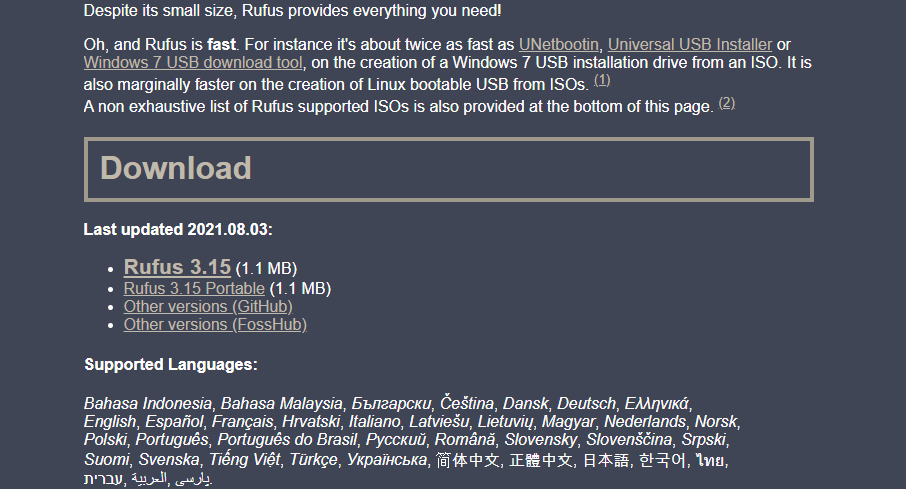


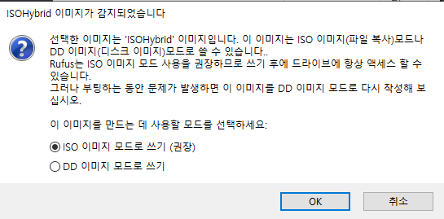


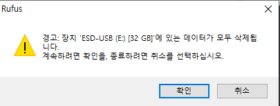


​	

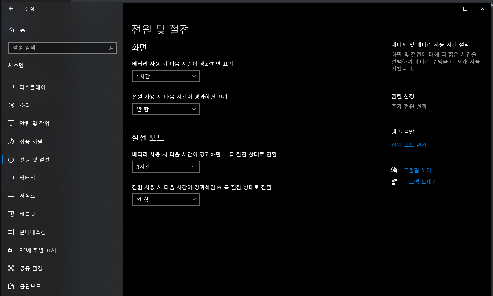


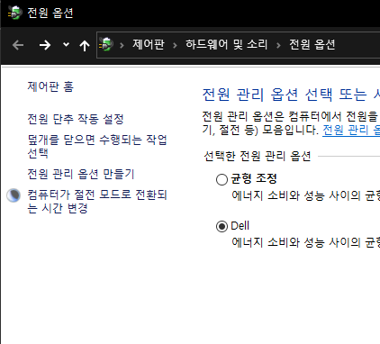


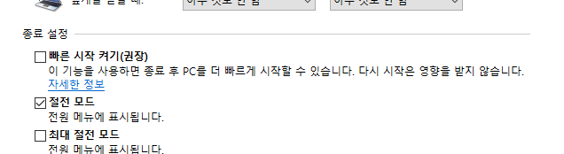


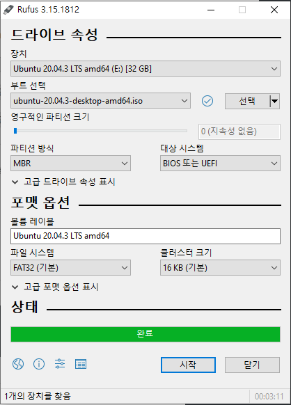


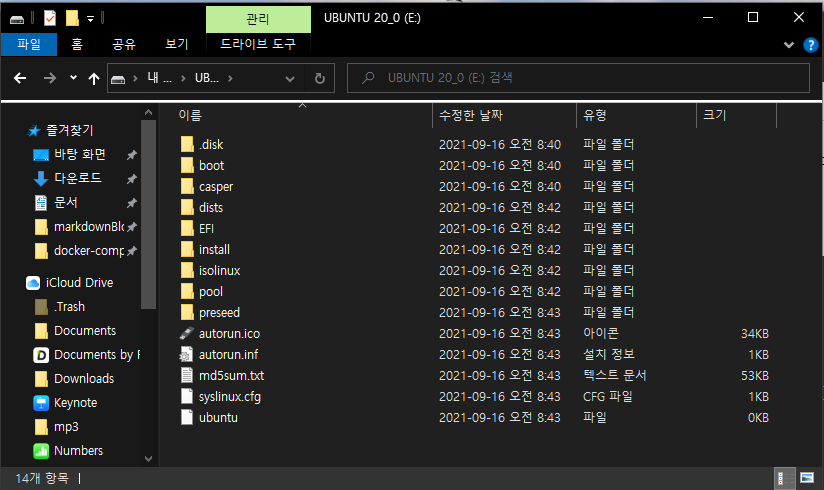


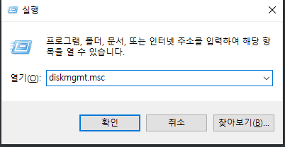

diskmgmt.msc


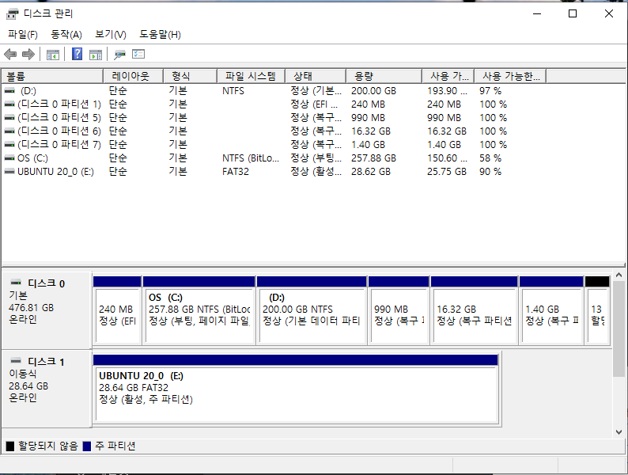


### Switch Windows 10 from RAID/IDE to AHCI


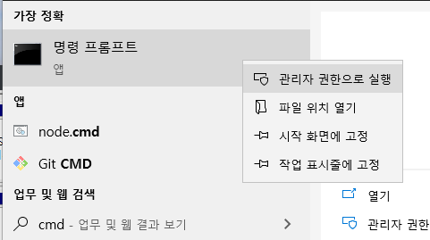


```
bcdedit /set safeboot minimal
```

​	

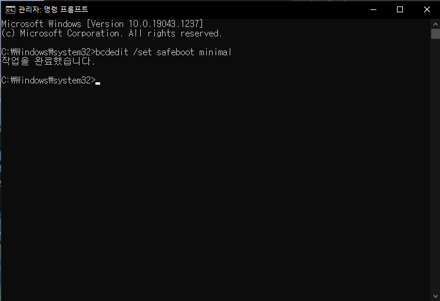


