# Windows 에서 bashrc 어쩌구 Vim vi alias 어쩌구 


```bash
vi
```


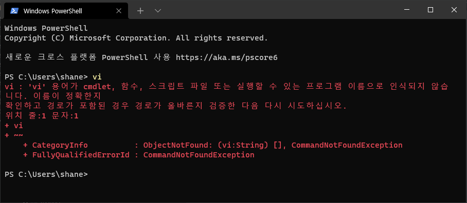


```bash
vim
```

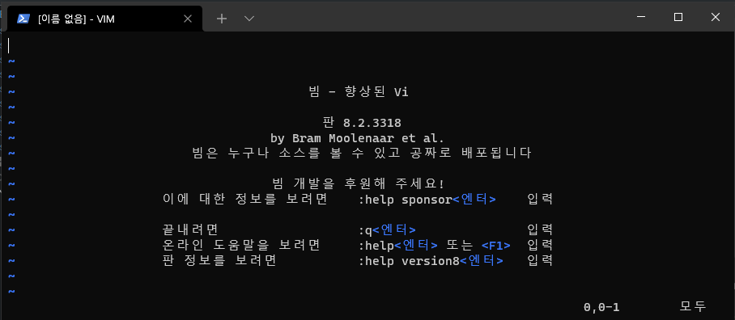


```bash
Get-Alias
```

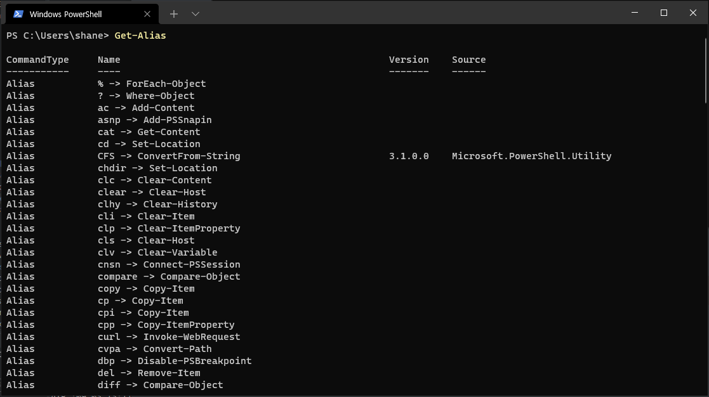


```bash
Set-Alias vi vim
```


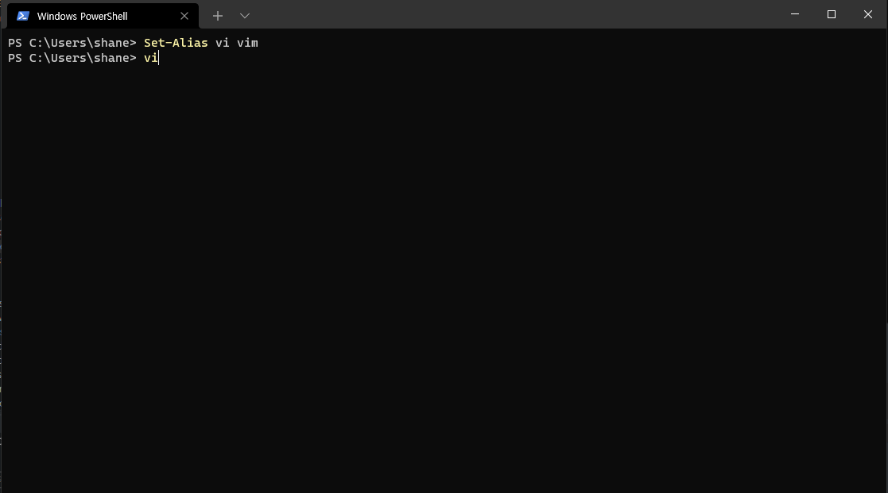

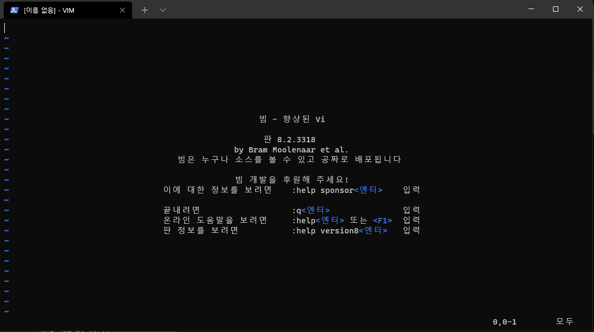


Terminal / PowerShell 을 껐다 다시 켜면

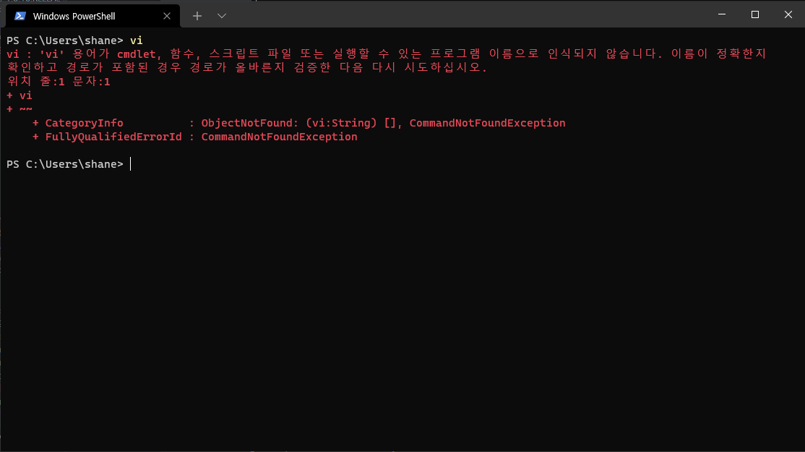


설정 영구 저장


```
$profile
```


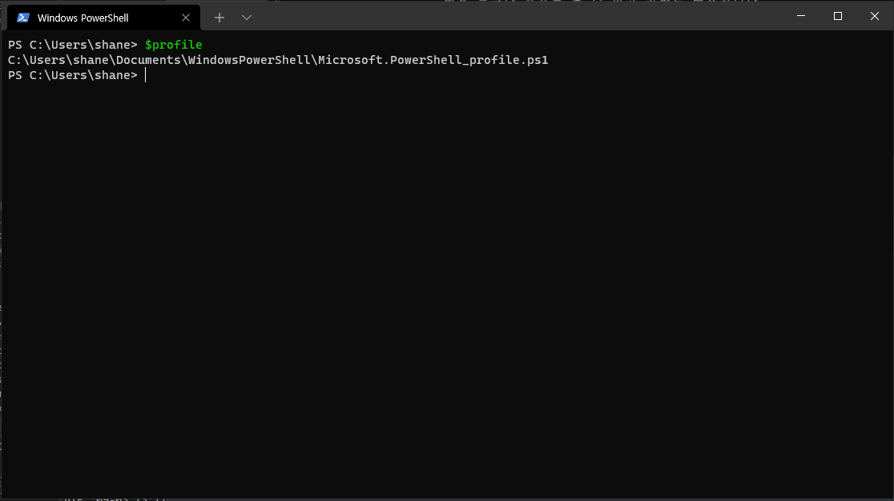


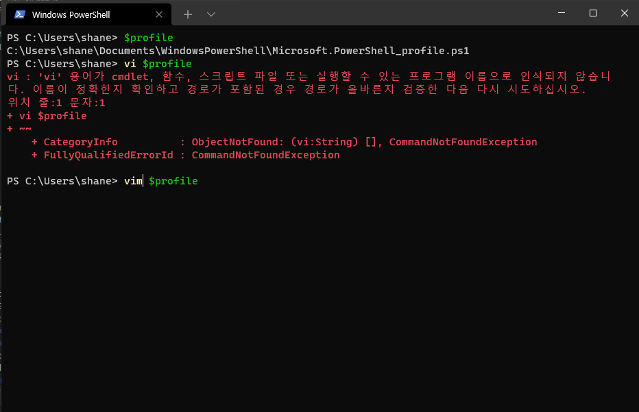

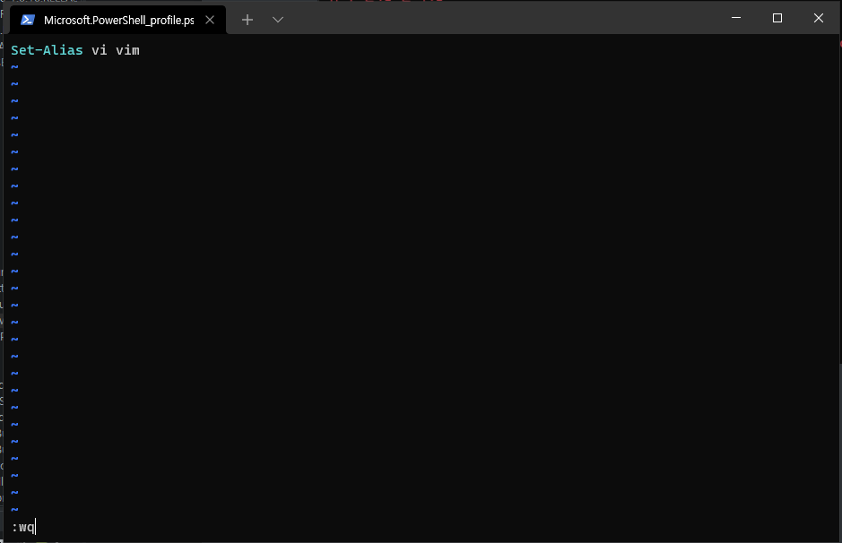


저장 하고 껐다 켜면


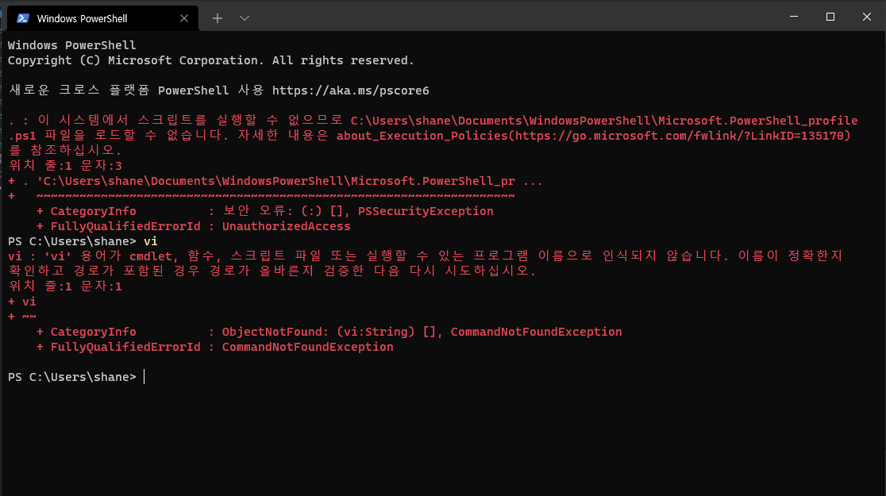

오히려 더 에러가 남 스크립트를 시행 할 수 없음

​	

```bash
get-help ExecutionPolicy
```


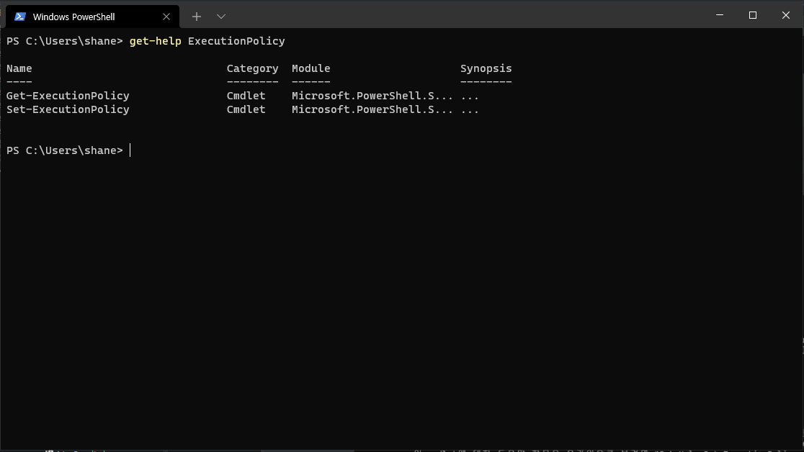


```bash
Get-ExecutionPolicy
```


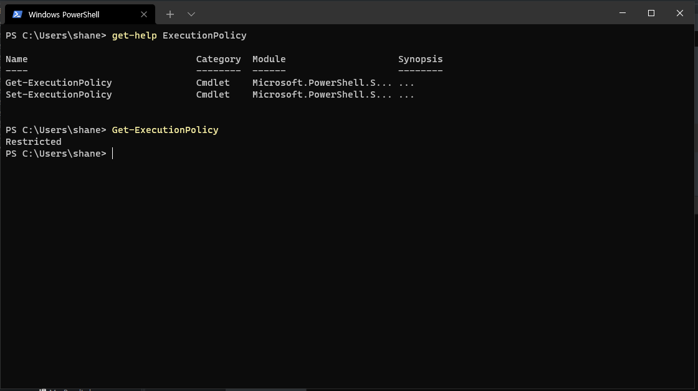

Restricted 라고 나오네요. ps1 스크립트 파일을 로드하여 실행 할 수 없는 정책 입니다.


```bash
get-help Set-ExecutionPolicy
```

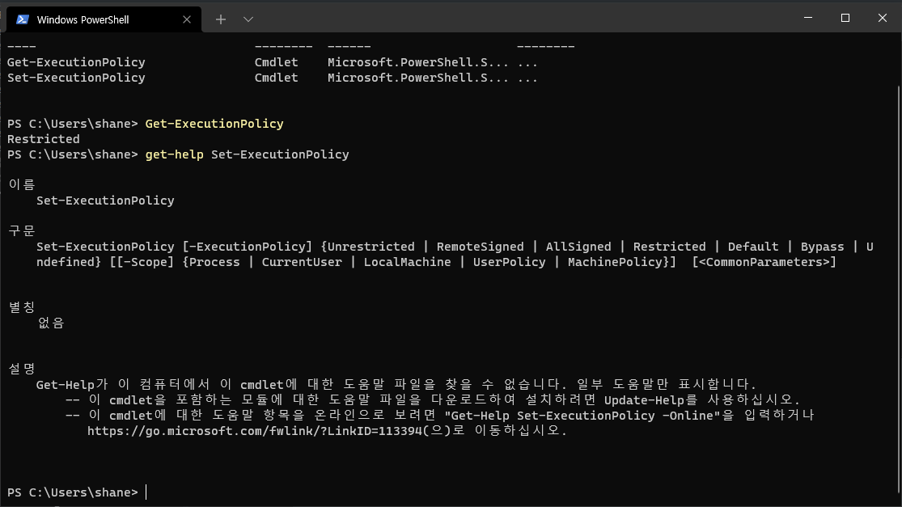


```bash
Set-ExecutionPolicy remoteSigned
```


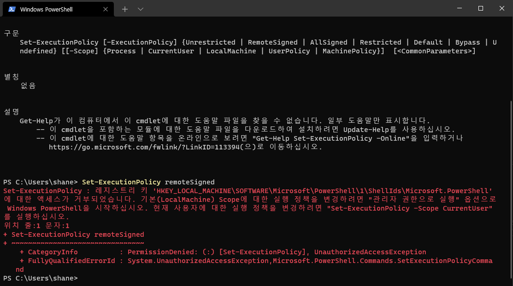


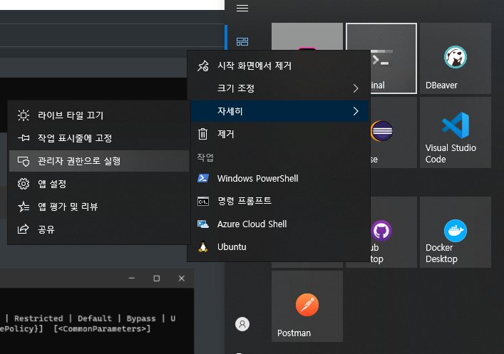

```bash
Set-ExecutionPolicy remoteSigned
```


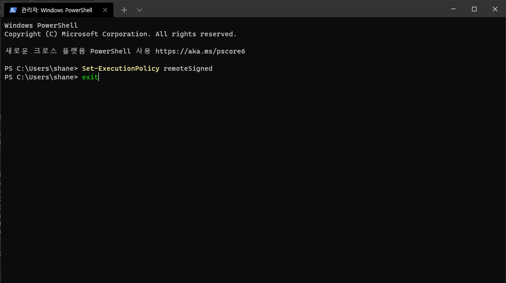


새로 켭니다 관리자 모드로 켤 필요 없습니다.


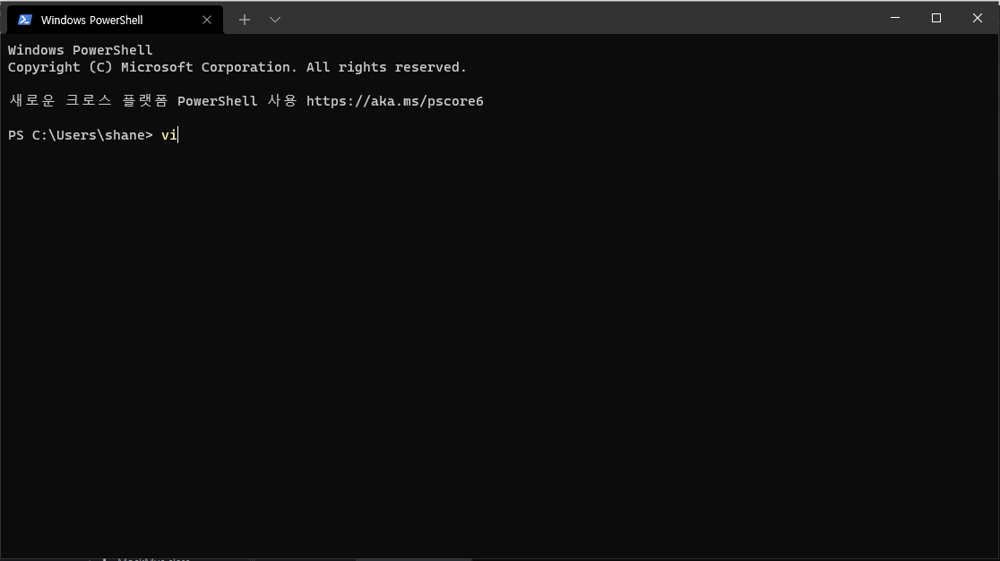


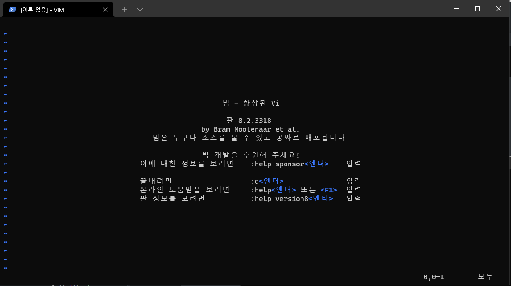