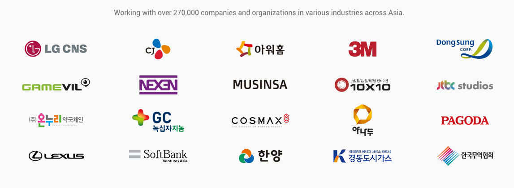
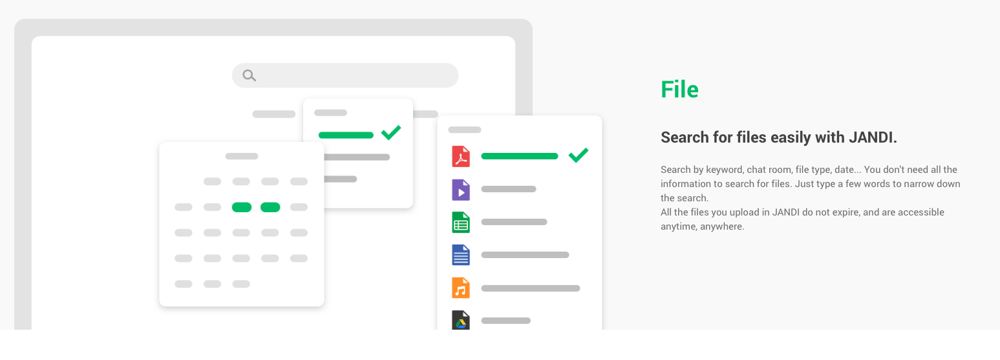
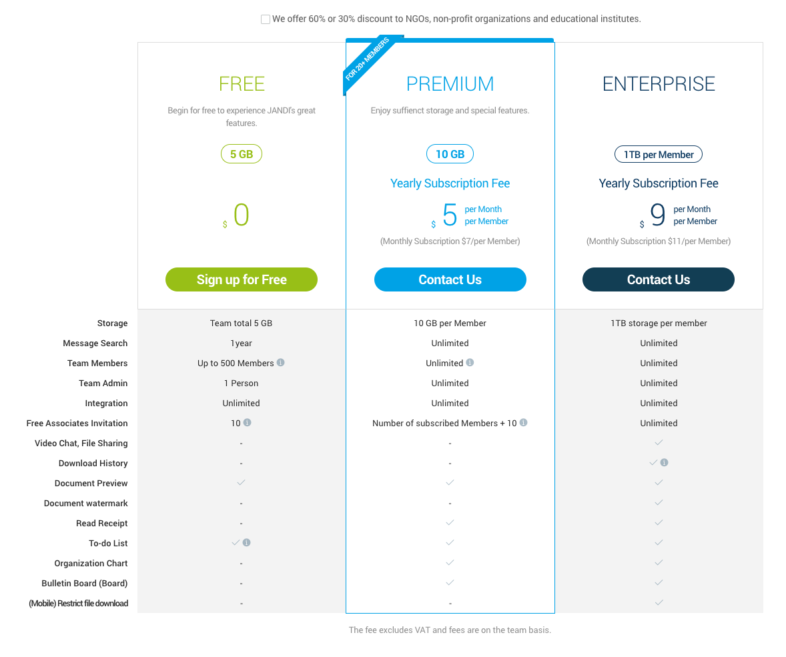
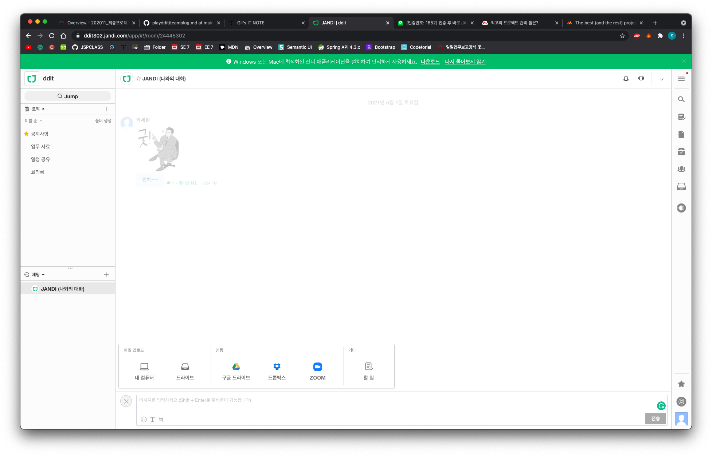
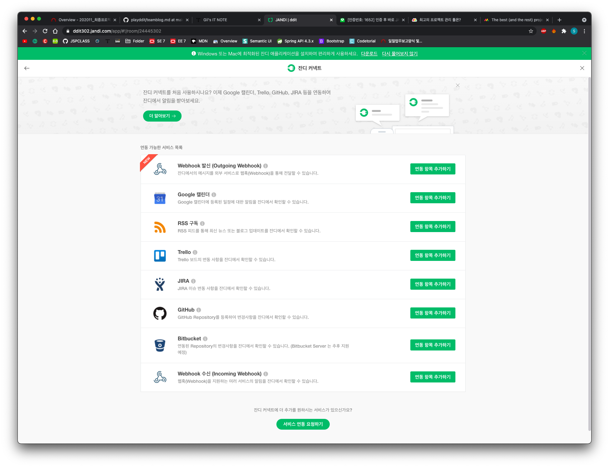
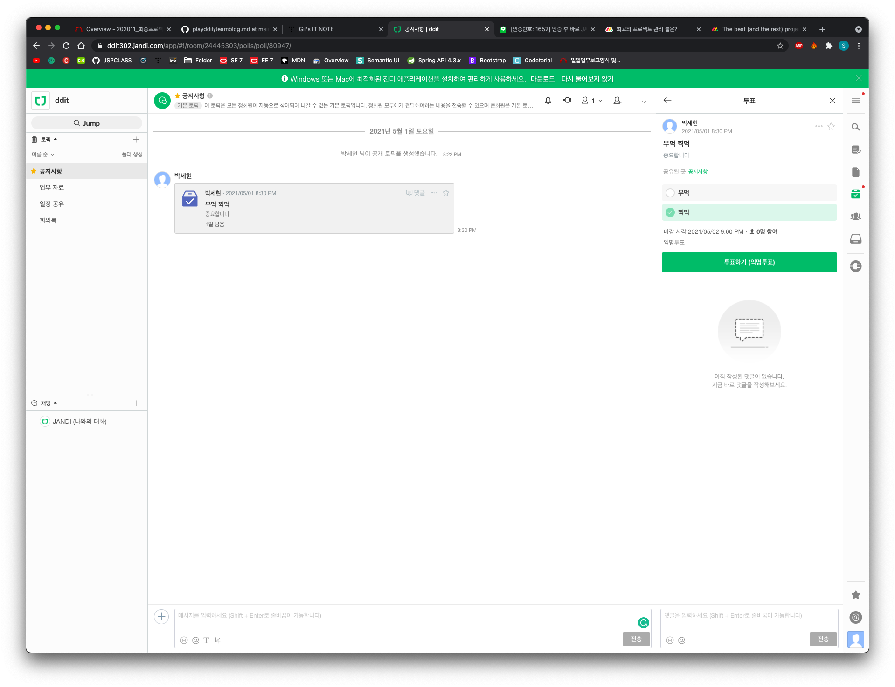
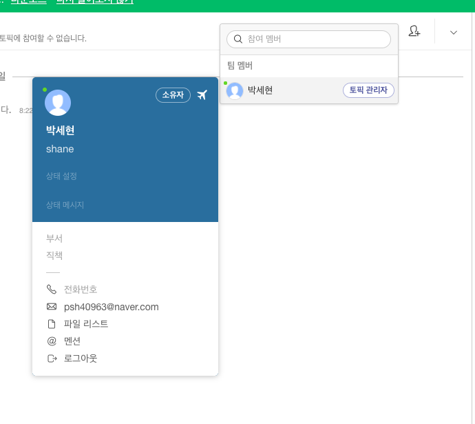

# Jandi
>토스랩에서 운영하는 대한민국 대표 업무용 협업툴 서비스.

㈜토스랩은 2014년 6월에 설립된 글로벌 IT 스타트업이다. 서울을 본사로 대만, 일본, 말레이시아, 베트남, 아랍에미리트(UAE)등 약 63개국의 기업고객을 보유중이며, 총 39명(본사 33명, 해외 6명)의 인원이 근무하고 있다. 잔디는 일을 잘 하게 도와주는 업무용 협업툴로 업무/팀별 그룹 채팅, 프로젝트 관리, 파일 공유 및 관리, 외부 서비스 연동 기능을 지원하는 클라우드 기반 협업 소프트웨어(SaaS)다.

2019년 12월 '제20회 소프트웨어(SW)산업인의 날'에서 서비스 우수성을 인정받아 SW산업발전유공 장관 표창을 수상한 바 있다. 2017년 3월 유료 버전 출시 이래 LG CNS, CJ, 아워홈, 무신사, 코스맥스, 넥센타이어 등 20만 개 이상의 기업 및 팀이 잔디를 사용하고 있다. 소프트뱅크벤처스, 퀄컴벤처스, 체루빅벤처스, SBI 인베스트먼트 등으로부터 총 130억 원의 투자를 유치했다.

## Main features

 

### 1. Chat Room

### 2. File

### 3. And

### 4. Admin & Integration

### 5. Collaboration 

### Price

### Screenshots

