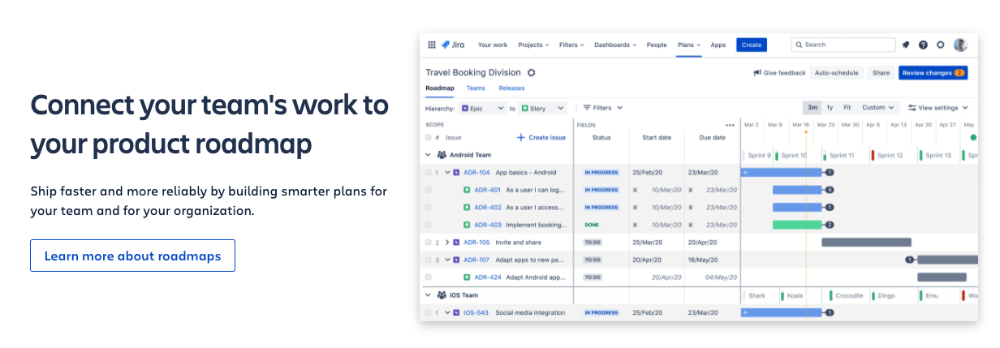
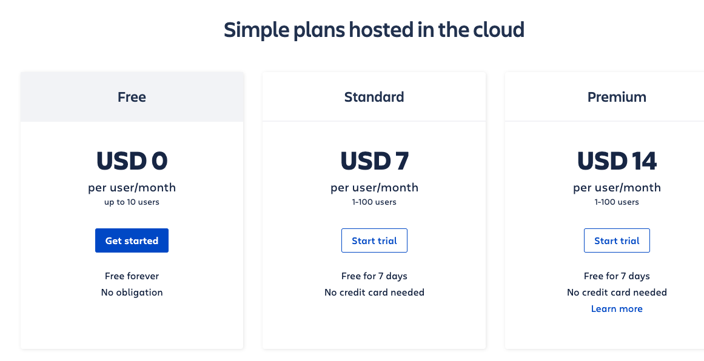
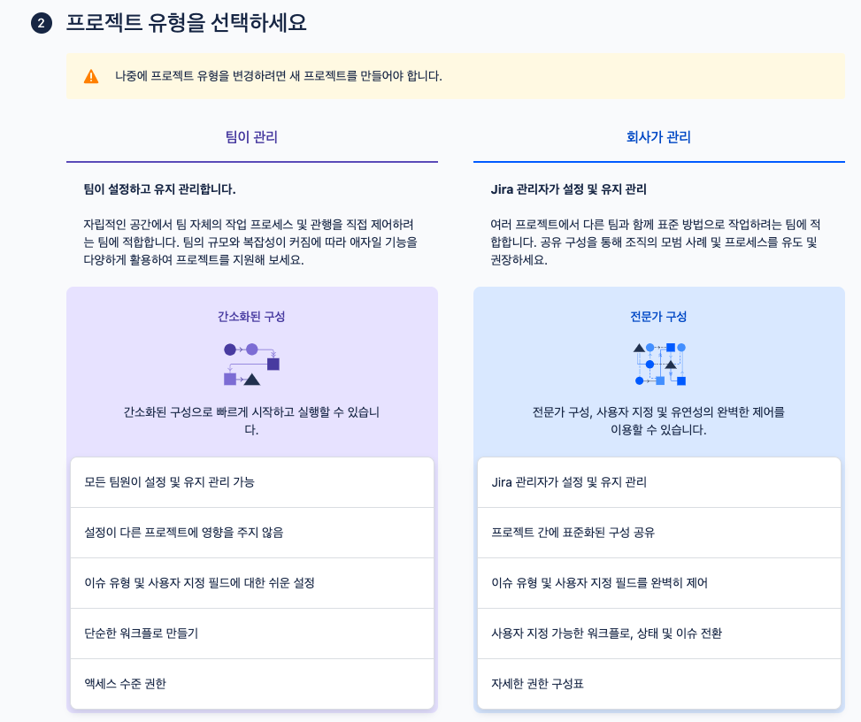
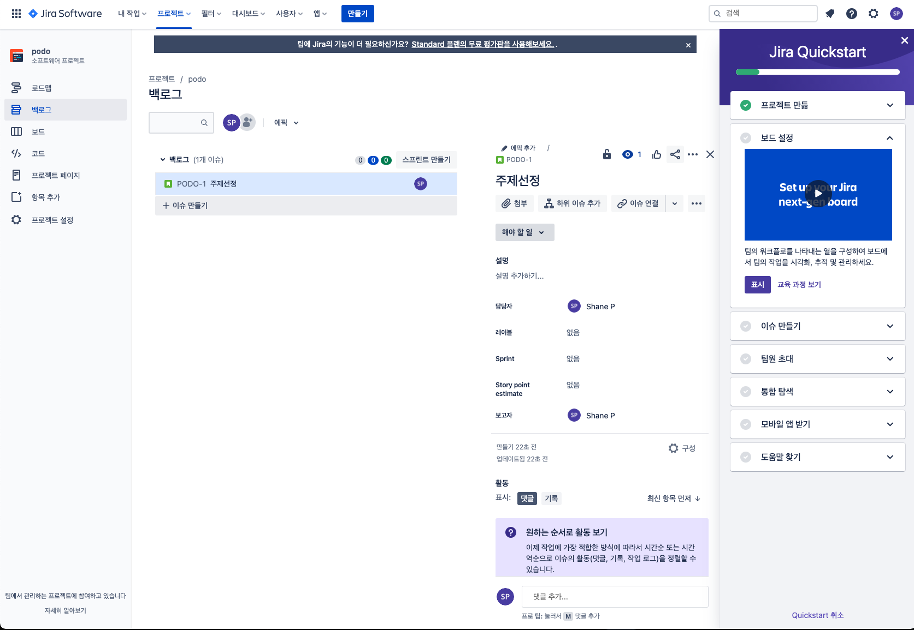
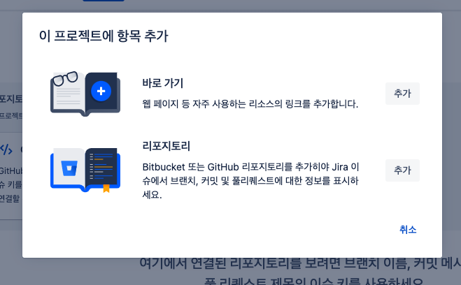
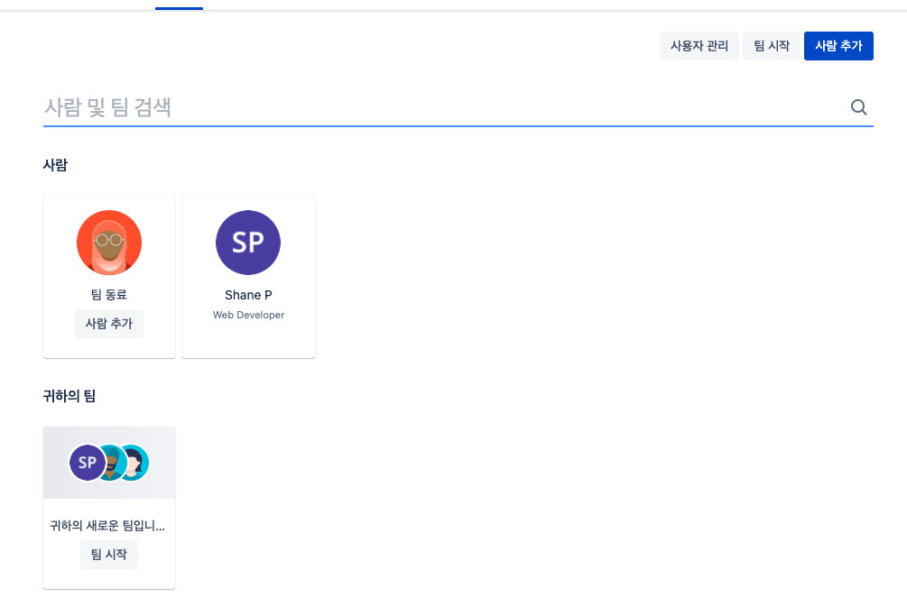

# Jira
>지라(JIRA)는 아틀라시안이 개발한 사유 이슈 추적 제품이다. 버그 추적, 이슈 추적, 프로젝트 관리 기능을 제공하는 소프트웨어이다.

### 특징
> Single Page Application

### Naming
>The product name is a truncation of Gojira, the Japanese word for Godzilla.The name originated from a nickname Atlassian developers used to refer to Bugzilla, which was previously used internally for bug-tracking.

### Description
>According to Atlassian, Jira is used for issue tracking and project management by over 180,000 customers in 190 countries. Some of the organizations that have used Jira at some point in time for bug-tracking and project management include Fedora Commons, Hibernate, and the Apache Software Foundation, which uses both Jira and Bugzilla. Jira includes tools allowing migration from competitor Bugzilla.

Jira is offered in four packages:
>Jira Core is intended as generic project management.
Jira Software includes the base software, including agile project management features (previously a separate product: Jira Agile).
Jira Service Management is intended for use by IT operations or business service desks.

>Jira Align is intended for strategic product and portfolio management
Jira is written in Java and uses the Pico inversion of control container, Apache OFBiz entity engine, and WebWork 1 technology stack. For remote procedure calls (RPC), Jira has REST, SOAP, and XML-RPC interfaces.Jira integrates with source control programs such as Clearcase, Concurrent Versions System (CVS), Git, Mercurial, Perforce, Subversion, and Team Foundation Server. It ships with various translations including English, French, German, Japanese, and Spanish.

>Jira implements the Networked Help Desk API for sharing customer support tickets with other issue tracking systems 

 
  

### software development tool 

### plan,track, and release

### workflow

### Integrate

### roadmap

### price

## Screenshots

