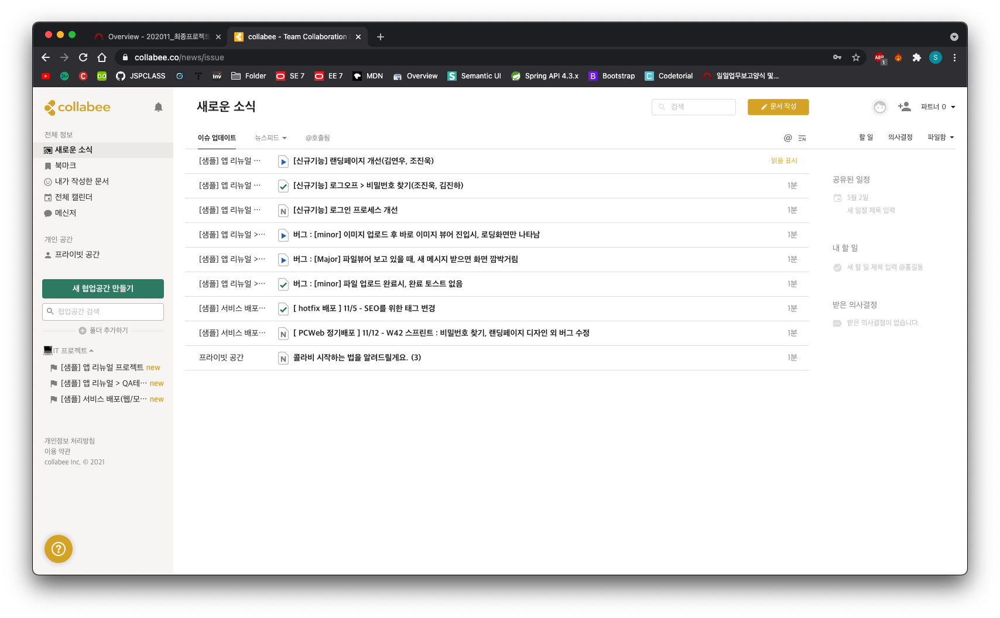
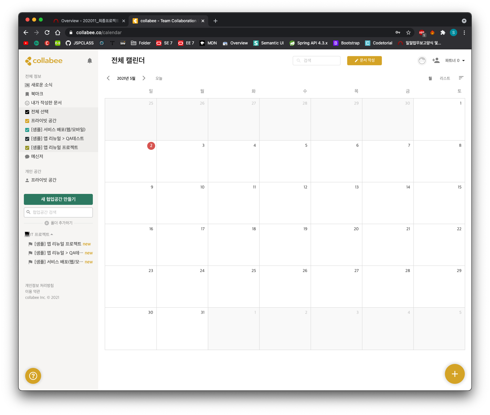

# Collabee
>콜라비는 국내 유일 <b>원페이지 협업툴(Collaboration Software)</b>이다. 실시간 동시 편집이 가능한 문서를 기반으로 할 일 및 일정 관리, 프로젝트 관리와 커뮤니케이션 모두 한 페이지에서 관리할 수 있다. 세부적인 기능으로는 한 페이지 안에서 팀원들과 함께 실시간 문서 작성 및 수정이 가능하고, 본문에서 '@'키를 이용해 할 일, 의사결정, 파일 공유, 동료 호출 등을 간단히 할 수 있다. 페이지 우측에는 댓글 스레드도 배치되어 있어 업무를 하면서 댓글을 통해 커뮤니케이션 할 수 있다.

> 원페이지 협업툴과 연동된 콜라비 메신저는 중요한 대화를 클릭만으로 콜라비 내 페이지로 문서화할 수 있다. 대화 내역을 쉽게 문서화함으로써 메신저의 휘발성 한계를 보완하는 유일한 기업용 메신저로 평가받고 있다.

### 1. 협업공간

### 2. 독립공간

### 3. 문서공유

### 4. 프로젝트 관리

### 5. 전체 디자인
> 메일함 같은 구조를 가지고 있음

### 6. 가격

# Collabee 메신저

# Collabee 사용예시
### 메일 인증

### 첫 페이지

### 일정 혹은 할일 추가

### 칸반 문서 생성

### 캘린더

### 키보드 단축키
