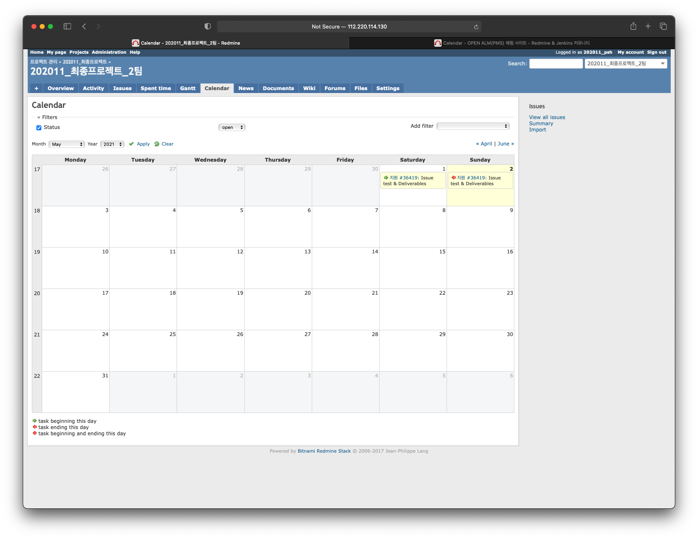

# Redmine

레드마인(Redmine)은 오픈 소스 프로그램으로 웹 기반의 프로젝트 관리 와 버그 추적 기능을 제공하는 도구이다. 화면기반의 프로젝트 관리에 도움이 되도록 달력과 간트 차트를 제공하고 일정관리 기능을 제공한다. 또한 레드마인은 통합된 프로젝트관리 기능과 이슈추적, 여러가지 형상 관리 기능을 제공한다.

레드마인의 디자인은 비슷한 기능을 가지는 오픈 소스 프로그램인 Trac에 영향을 많이 받았으며 루비 온 레일즈에 기반하여 작성되었고 멀티 플랫폼을 지원하며 여러가지 종류의 데이터베이스 및 34개의 언어를 지원한다.

## 특징
- 다중 프로젝트 지원
- 유연한 역할기반 접근제어
- 유연한 이슈추적 기능
- 간트 차트와 달력기능 제공
- 알림, 문서, 파일관리기능 제공
- 이메일 알람기능
- 프로젝트별 위키 페이지 제공
- 프로젝트별 게시판 기능 제공
- 형상 관리 소프트웨어와의 통합(SVN, CVS, Git, Mercurial, Bazaar, Darcs)
- 다중 LDAP 기반 인증 지원
- 다국어 지원
- 여러 데이터베이스 지원
- 플러그인 기능 지원
- 관련 모바일 앱

### 1. Dashboard

### 2. Activity

### 3. Roadmap

### 4. Issue

### 5. Spent time

### 6. Gantt chart

### 7. Calendar

### 8. News

### 9. Wiki
