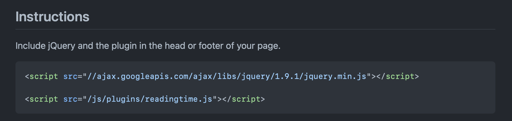
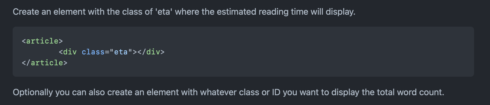
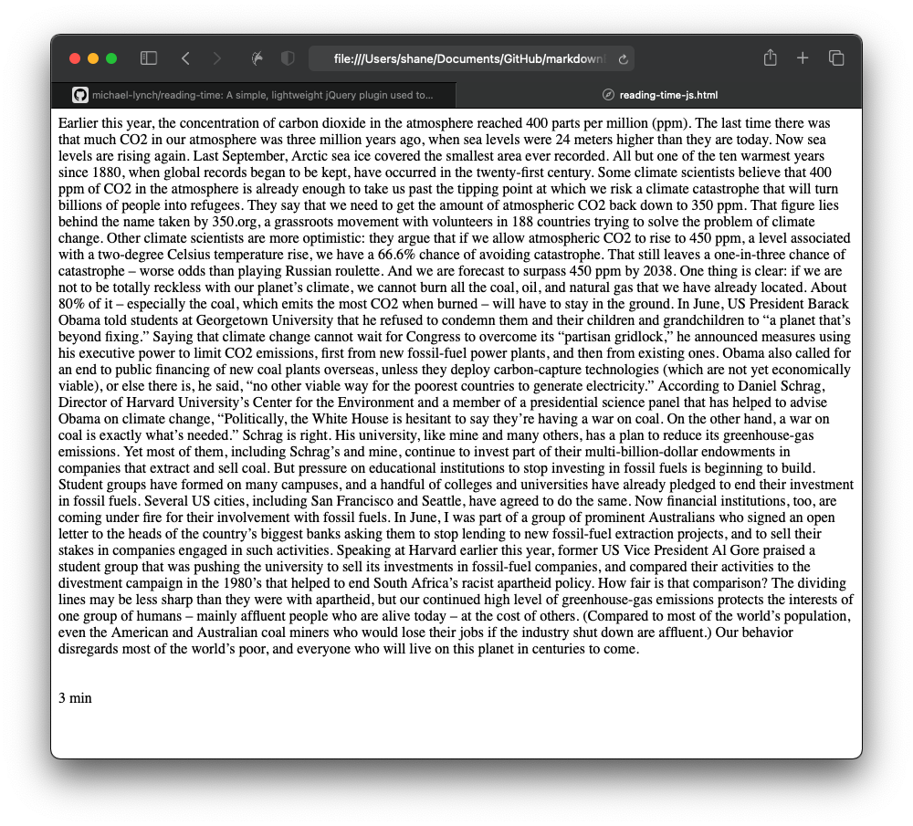
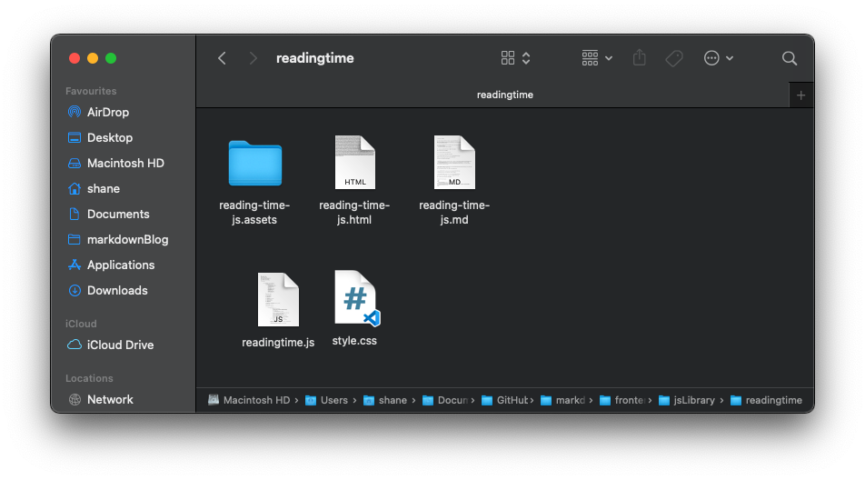
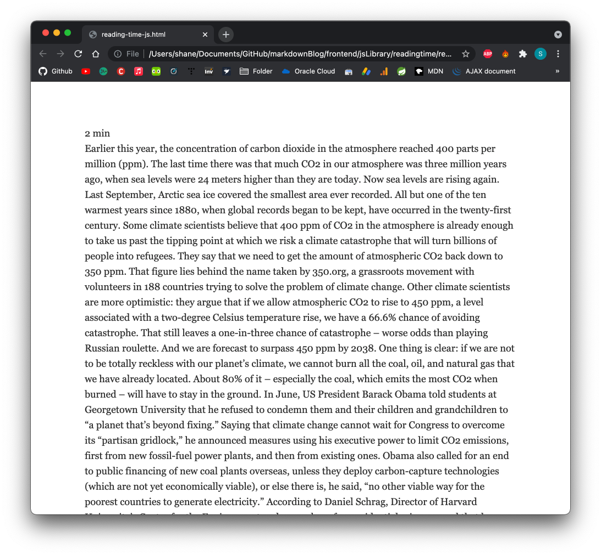
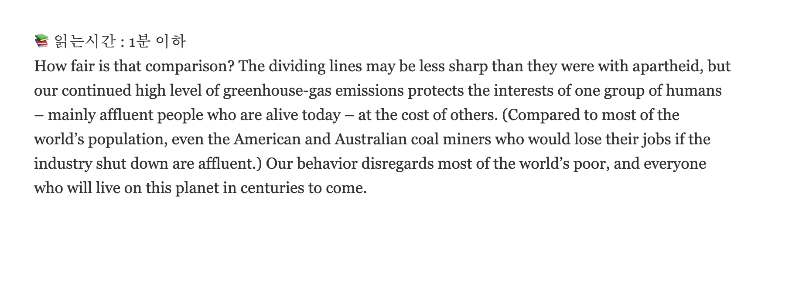
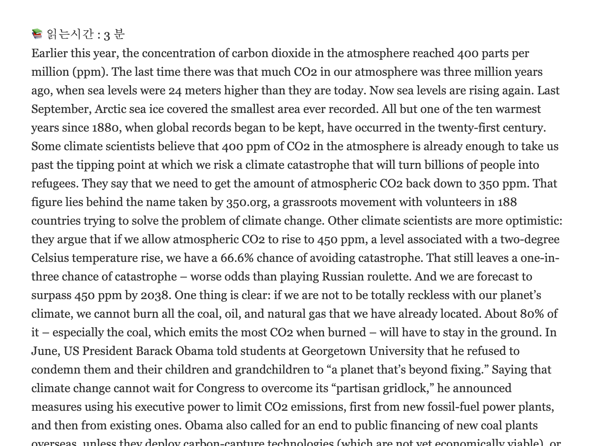

# reading-time.js 활용해 읽는 시간 표시해주기

​	

### 요즘 해외 뉴스나 블로그 등 에서 많이 사용 되고 있는 reading time 라이브러리 입니다. 

보통 글의 header 부분의 제목 바로 다음에서 해당 article을 읽는데 대략 어느 정도가 걸리는지 시간으로 알려줌으로서 독자들이 빠르게 대강 읽을 지 혹은 천천히 꼼꼼히 읽을지를 결정하게끔 도와 줍니다.


## 

> 보통 이런식으로 얼마나 걸릴지를 미리 가늠할 수 있게 해줍니다.


저도 reading-time.js 를 블로그에 도입 하고자 그 기능들을 확인 해 보고 있습니다.

함께 하나씩 따라 해 보면서 기능을 익혀보겠습니다.

​	

https://github.com/michael-lynch/reading-time

일단 공식 Github repository에 들어가 정보를 수집 해 보았습니다.

​	



첫번째로 jQuery와 plugin을 page의 head 혹은 footer에 포함시키라고 합니다.

아직 연습 중이니 적당히 CDN을 사용 해 보도록 하겠습니다.

​	

```javascript
<script src="https://code.jquery.com/jquery-3.6.0.js" integrity="sha256-H+K7U5CnXl1h5ywQfKtSj8PCmoN9aaq30gDh27Xc0jk=" crossorigin="anonymous"></script>
    <script src="https://cdnjs.cloudflare.com/ajax/libs/reading-time/2.0.0/readingTime.js" integrity="sha512-YWeIytX1fEAyaUgR1iSJgoYrWKxZH/I8XmviT/MqvZUPCabDslO7tyZOwdpJ0kNZBU1hwOQ1lTbEEcmK2jtghQ==" crossorigin="anonymous" referrerpolicy="no-referrer"></script>
```

​		

이번에는 읽는데 소요되는 예상 시간이 보여질 element를 만들으라고 합니다. class 이름은 eta로 하라고 하네요.

또한 총 단어 갯수를 보여주고 싶다면 아무 class 나 ID로 하나 더 만들어 보라고도 합니다.	

​	


총 단어 갯수를 보여줄 word-count 요소도 만든다면 이런 식으로 만들 수 있겠습니다.

​	


이제 마지막으로 target이 될 요소를 대상으로 .readingTime() 함수를 호출 해 주면 끝이 납니다. 

한번 이런 내용만으로도 잘 작동 하는지 테스트 해 보도록 하겠습니다.

​		

테스트용도로 만들어 본 html 파일 입니다.

```html
<html>
<head>
    <meta charset="UTF-8">
    <script src="https://code.jquery.com/jquery-3.6.0.js" integrity="sha256-H+K7U5CnXl1h5ywQfKtSj8PCmoN9aaq30gDh27Xc0jk=" crossorigin="anonymous"></script>
    <script src="https://cdnjs.cloudflare.com/ajax/libs/reading-time/2.0.0/readingTime.js" integrity="sha512-YWeIytX1fEAyaUgR1iSJgoYrWKxZH/I8XmviT/MqvZUPCabDslO7tyZOwdpJ0kNZBU1hwOQ1lTbEEcmK2jtghQ==" crossorigin="anonymous" referrerpolicy="no-referrer"></script>
</head>
<body>
    <article>
           <div>
            Earlier this year, the concentration of carbon dioxide in the atmosphere reached 400 parts per million (ppm). The last time there was that much CO2 in our atmosphere was three million years ago, when sea levels were 24 meters higher than they are today. Now sea levels are rising again. Last September, Arctic sea ice covered the smallest area ever recorded. All but one of the ten warmest years since 1880, when global records began to be kept, have occurred in the twenty-first century.

            Some climate scientists believe that 400 ppm of CO2 in the atmosphere is already enough to take us past the tipping point at which we risk a climate catastrophe that will turn billions of people into refugees. They say that we need to get the amount of atmospheric CO2 back down to 350 ppm. That figure lies behind the name taken by 350.org, a grassroots movement with volunteers in 188 countries trying to solve the problem of climate change.
            
            Other climate scientists are more optimistic: they argue that if we allow atmospheric CO2 to rise to 450 ppm, a level associated with a two-degree Celsius temperature rise, we have a 66.6% chance of avoiding catastrophe. That still leaves a one-in-three chance of catastrophe – worse odds than playing Russian roulette. And we are forecast to surpass 450 ppm by 2038.
            
            One thing is clear: if we are not to be totally reckless with our planet’s climate, we cannot burn all the coal, oil, and natural gas that we have already located. About 80% of it – especially the coal, which emits the most CO2 when burned – will have to stay in the ground.
            
            In June, US President Barack Obama told students at Georgetown University that he refused to condemn them and their children and grandchildren to “a planet that’s beyond fixing.” Saying that climate change cannot wait for Congress to overcome its “partisan gridlock,” he announced measures using his executive power to limit CO2 emissions, first from new fossil-fuel power plants, and then from existing ones.
            
            Obama also called for an end to public financing of new coal plants overseas, unless they deploy carbon-capture technologies (which are not yet economically viable), or else there is, he said, “no other viable way for the poorest countries to generate electricity.”
            
            According to Daniel Schrag, Director of Harvard University’s Center for the Environment and a member of a presidential science panel that has helped to advise Obama on climate change, “Politically, the White House is hesitant to say they’re having a war on coal. On the other hand, a war on coal is exactly what’s needed.”
            
            Schrag is right. His university, like mine and many others, has a plan to reduce its greenhouse-gas emissions. Yet most of them, including Schrag’s and mine, continue to invest part of their multi-billion-dollar endowments in companies that extract and sell coal.
            
            But pressure on educational institutions to stop investing in fossil fuels is beginning to build. Student groups have formed on many campuses, and a handful of colleges and universities have already pledged to end their investment in fossil fuels. Several US cities, including San Francisco and Seattle, have agreed to do the same.
            
            Now financial institutions, too, are coming under fire for their involvement with fossil fuels. In June, I was part of a group of prominent Australians who signed an open letter to the heads of the country’s biggest banks asking them to stop lending to new fossil-fuel extraction projects, and to sell their stakes in companies engaged in such activities.
            
            Speaking at Harvard earlier this year, former US Vice President Al Gore praised a student group that was pushing the university to sell its investments in fossil-fuel companies, and compared their activities to the divestment campaign in the 1980’s that helped to end South Africa’s racist apartheid policy.
            
            How fair is that comparison? The dividing lines may be less sharp than they were with apartheid, but our continued high level of greenhouse-gas emissions protects the interests of one group of humans – mainly affluent people who are alive today – at the cost of others. (Compared to most of the world’s population, even the American and Australian coal miners who would lose their jobs if the industry shut down are affluent.) Our behavior disregards most of the world’s poor, and everyone who will live on this planet in centuries to come.
           </div>
        </div>
    </article>
    <br /><br />
    <div class="eta"></div>
    <script>
        $('article').readingTime();
    </script>
</body>
</html>
```

정말 더도 말고 덜도 말고 reading-time 깃헙 저장소의 readme.md 파일에 나온 설명대로만 작성 해 보았습니다.

거기에 추가로 article 안에는 적당히 글도 작성 해 보았습니다. 자 이제  html 파일을 브라우저에서 띄워 보면 ..

​	



article을 잘 분석 해서 3분짜리라고 알려줍니다. 제 기준에선 아무리 봐도 3분짜리 article로는 보이지 않지만.. 원어민들은 이정도면 3분 짜리 글 인가 봅니다..

​	


다양한 Option 들도 사용 할 수 있습니다. 아쉽게도 한국어는 포함되어 있지 않네요. 

​	

​	

> 그래서 제가 한국어를 추가 해서 Pull request 를 올려 두었습니다.

​	

한국어를 추가 했으니 제가 편집한 버전으로 새로 불러 오겠습니다.



같은 폴더에 readingtime.js 과 style.css 파일을 넣고

​		

```html
 <link rel="stylesheet" href="./style.css">
    <script src="https://code.jquery.com/jquery-3.6.0.js" integrity="sha256-H+K7U5CnXl1h5ywQfKtSj8PCmoN9aaq30gDh27Xc0jk=" crossorigin="anonymous"></script>
    <script src="./readingtime.js"></script>
```

css 와 js 파일을 새로 첨부해줍니다.	

​		

### 그렇게 새로 만들어 본 reading-time-js.html 입니다.

```html
<html>
<head>
    <meta charset="UTF-8">
    <link rel="stylesheet" href="./style.css">
    <script src="https://code.jquery.com/jquery-3.6.0.js" integrity="sha256-H+K7U5CnXl1h5ywQfKtSj8PCmoN9aaq30gDh27Xc0jk=" crossorigin="anonymous"></script>
    <script src="./readingtime.js"></script>
</head>
<body>
    <div class="eta"></div>
    <article>
           <div>
            Earlier this year, the concentration of carbon dioxide in the atmosphere reached 400 parts per million (ppm). The last time there was that much CO2 in our atmosphere was three million years ago, when sea levels were 24 meters higher than they are today. Now sea levels are rising again. Last September, Arctic sea ice covered the smallest area ever recorded. All but one of the ten warmest years since 1880, when global records began to be kept, have occurred in the twenty-first century.

            Some climate scientists believe that 400 ppm of CO2 in the atmosphere is already enough to take us past the tipping point at which we risk a climate catastrophe that will turn billions of people into refugees. They say that we need to get the amount of atmospheric CO2 back down to 350 ppm. That figure lies behind the name taken by 350.org, a grassroots movement with volunteers in 188 countries trying to solve the problem of climate change.
            
            Other climate scientists are more optimistic: they argue that if we allow atmospheric CO2 to rise to 450 ppm, a level associated with a two-degree Celsius temperature rise, we have a 66.6% chance of avoiding catastrophe. That still leaves a one-in-three chance of catastrophe – worse odds than playing Russian roulette. And we are forecast to surpass 450 ppm by 2038.
            
            One thing is clear: if we are not to be totally reckless with our planet’s climate, we cannot burn all the coal, oil, and natural gas that we have already located. About 80% of it – especially the coal, which emits the most CO2 when burned – will have to stay in the ground.
            
            In June, US President Barack Obama told students at Georgetown University that he refused to condemn them and their children and grandchildren to “a planet that’s beyond fixing.” Saying that climate change cannot wait for Congress to overcome its “partisan gridlock,” he announced measures using his executive power to limit CO2 emissions, first from new fossil-fuel power plants, and then from existing ones.
            
            Obama also called for an end to public financing of new coal plants overseas, unless they deploy carbon-capture technologies (which are not yet economically viable), or else there is, he said, “no other viable way for the poorest countries to generate electricity.”
            
            According to Daniel Schrag, Director of Harvard University’s Center for the Environment and a member of a presidential science panel that has helped to advise Obama on climate change, “Politically, the White House is hesitant to say they’re having a war on coal. On the other hand, a war on coal is exactly what’s needed.”
            
            Schrag is right. His university, like mine and many others, has a plan to reduce its greenhouse-gas emissions. Yet most of them, including Schrag’s and mine, continue to invest part of their multi-billion-dollar endowments in companies that extract and sell coal.
            
            But pressure on educational institutions to stop investing in fossil fuels is beginning to build. Student groups have formed on many campuses, and a handful of colleges and universities have already pledged to end their investment in fossil fuels. Several US cities, including San Francisco and Seattle, have agreed to do the same.
            
            Now financial institutions, too, are coming under fire for their involvement with fossil fuels. In June, I was part of a group of prominent Australians who signed an open letter to the heads of the country’s biggest banks asking them to stop lending to new fossil-fuel extraction projects, and to sell their stakes in companies engaged in such activities.
            
            Speaking at Harvard earlier this year, former US Vice President Al Gore praised a student group that was pushing the university to sell its investments in fossil-fuel companies, and compared their activities to the divestment campaign in the 1980’s that helped to end South Africa’s racist apartheid policy.
            
            How fair is that comparison? The dividing lines may be less sharp than they were with apartheid, but our continued high level of greenhouse-gas emissions protects the interests of one group of humans – mainly affluent people who are alive today – at the cost of others. (Compared to most of the world’s population, even the American and Australian coal miners who would lose their jobs if the industry shut down are affluent.) Our behavior disregards most of the world’s poor, and everyone who will live on this planet in centuries to come.
           </div>
        </div>
    </article>
    <br /><br />
    <script>
        $('article').readingTime();
    </script>
</body>
</html>
```

​	

### 실행결과



심지어 새로운 버전에서는 사람들이 읽는 속도가 빨라졌는지 2분으로 줄었네요 !

​	

 지금은 .readingTime() 로 간단하게 실행 했지만 몇 가지 옵션을 활용한다면 좀 더 실용적으로 활용 할 수 있겠습니다. 특히 wordPerMinute 을 활용 한다면 좀 더 현실적인 reading time을 제시할 수 있겠네요. 몇가지 옵션을 알아보겠습니다. 

​		

### Options

- readingTimeAsNumber: boolean
  If you want to take reading time as integer, you can use this (default: 'false').

> 읽는 시간을 number로 받을지에 대한 옵션입니다. 기본 값은 false 입니다.

- readingTimeTarget: "id / class / element"
  A string that defines the ID, class or element that will store the estimated reading time (default: 'eta').

> 읽는 시간을 표시할 요소를 선택합니다. 따로 입력하지 않으면 기본은 eta 입니다.

- wordCountTarget: "id / class / element"
  A string that defines the ID, class or element that will store the total word count (default: '').

> 전체 단어 수를 세서 표시할 요소를 선택합니다. 

- remotePath: "path"
  A string that indicates the path to the remote file (default: null).

> 읽어서 분석할 문장이 html 요소가 아닌 외부 파일일 경우에 그 경로를 설정합니다.

- remoteTarget: "id / class / element"
  A string that defines the ID, class or element in the remote file that contains the text in which you want to estimate the reading time of (default: null).

> 외부 파일의 경로가 아닌 요소로서 접근 할 때 사용합니다.

- wordsPerMinute: integer
  An integer that defines the words per minute at which to calculate the estimated reading time (default: 270).

> 분당 몇 단어를 읽는지 읽는 속도를  정합니다. 따로 정해주지 않으면 분당 270 개로 계산됩니다.

- round: boolean
  A boolean value that indicates whether or not the estimated reading time should be rounded to the closest minute (default: true).

> 반올림을 할 지에 대한 설정입니다. 예를 들어 읽는데 2분 40초가 걸린다고 할때 round:true 로 되어 있으면 "3분" 으로 나오며 false 의 경우에는 2:40 라고 표기됩니다.

- lang: "en / fr / de / es / nl / sk / cz / ru / zh / kr"
  A two letter string that indicates the language to be used (default: "en").

> 사용할 언어를 선택합니다. 제가 kr을 추가 했습니다 ! 오늘 PR을 등록했는데 언제쯤 받아줄 지는 모르겠네요.

- lessThanAMinuteString: string
  A string that changes the default "Less than a minute" copy (default: '').

> 1분보다 적을 경우에 뭐라고 표시 해 줄지 설정할 수 있습니다.  따로 설정하지 않으면 각 언어별 기본 설정을 따라갑니다.



- prependTimeString: string
  A string that is prepended before the estimated reading time (default: '').

> 시간 앞에 미리 붙일 말을 쓸 수 있습니다.

- prependWordString: string
  A string that is prepended before the total word count (default: '').

> 총 단어 갯수 앞에도 쓸 말을 설정 할 수 있습니다.

- success: function(data) {}
  A callback function that runs if the plugin was successful (default: `function()`).

- error: function(data) {}
  A callback function that runs if the plugin fails (default: `function(message)`).

> 각각 성공/실패시의 callback function 입니다.

​	

위의 옵션들을 토대로 간단하게 설정을 해 보았습니다.

```javascript
$('article').readingTime({
  readingTimeAsNumber: false,
  readingTimeTarget: $('.eta'),
  wordsPerMinute: 200,
  round: true,
  prependTimeString: '📚 읽는시간 : ',
  lang: 'kr',
  success: function(data) {
    console.log(data);
  },
  error: function(data) {
    console.log(data.error);
  }
});
```

​	

### 그 결과입니다.



##### 		

잘만 설정 해 준다면 꽤나 도움이 될 수 있겠습니다.

차근 차근 블로그에도 적용 시켜 볼 계획입니다 ! 이상입니다.
