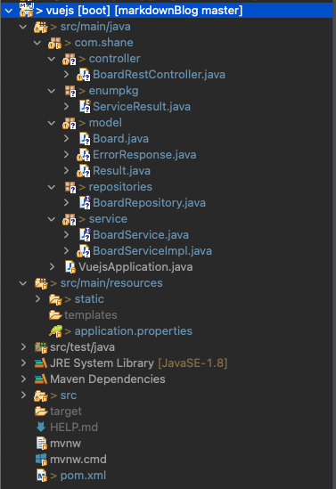
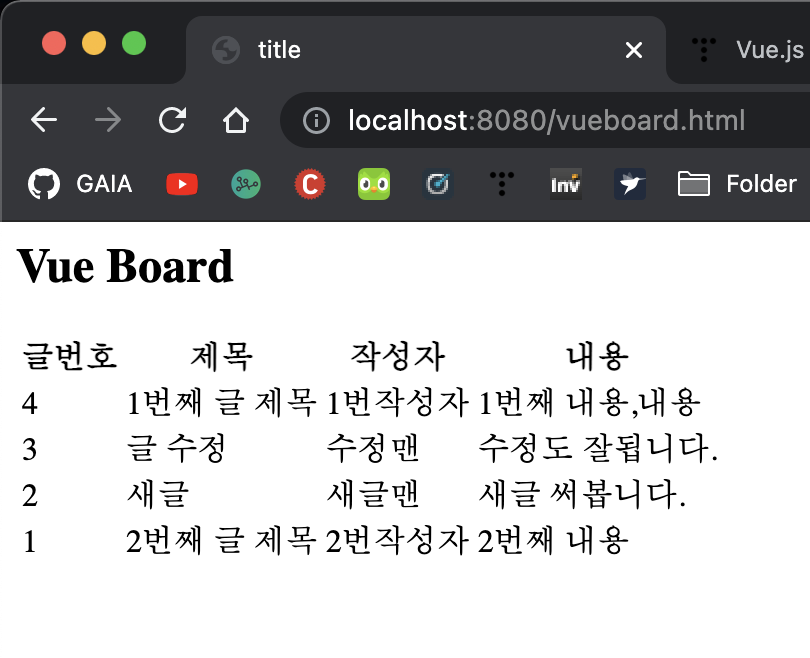

# Vue.js 사용 하기 2 ) PostgreSQL로 간단 게시판 작성

​	

Vue.js, SpringBoot, PostgreSQL, Hibernate 중 익숙하지 않은 기술이 있는 분은 아래의 두 포스팅을 참고하시면 코드를 잘 읽을 수 있습니다.

### [Vue.js 사용 하기 1 ) 기본 문법](https://shanepark.tistory.com/201)

> 윗 글에 이어지는 글입니다.

### [SpringBoot + PostgreSQL + Hibernate ) 간단한 게시판 만들기](https://shanepark.tistory.com/193)

 >  해당 글에서 SpringBoot + PostgreSQL + Hibernate 로 만들어둔 간단 게시판 api를 활용해서 Vue.js 로 화면을 만들어 보겠습니다.

​		

이번에는 Vue.js 를 이용해 아주 간단한 게시판 페이지를 렌더링 해 보도록 하겠습니다.

​	

### 전체적인 패키지 구조는 아래와 같으며 자바 코드는 모두 위의 간단 게시판 만들기에서 작성한 restapi 들을 그대로 가져와서 활용했습니다.



​	

### 일단 pom.xml 부터 확인해보겠습니다.

```xml
<?xml version="1.0" encoding="UTF-8"?>
<project xmlns="http://maven.apache.org/POM/4.0.0"
	xmlns:xsi="http://www.w3.org/2001/XMLSchema-instance"
	xsi:schemaLocation="http://maven.apache.org/POM/4.0.0 https://maven.apache.org/xsd/maven-4.0.0.xsd">
	<modelVersion>4.0.0</modelVersion>
	<parent>
		<groupId>org.springframework.boot</groupId>
		<artifactId>spring-boot-starter-parent</artifactId>
		<version>2.5.3</version>
		<relativePath /> <!-- lookup parent from repository -->
	</parent>
	<groupId>com.shane</groupId>
	<artifactId>vuejs</artifactId>
	<version>0.0.1-SNAPSHOT</version>
	<name>vuejs</name>
	<description>vuejs practice</description>
	<properties>
		<java.version>1.8</java.version>
	</properties>
	<dependencies>
		<dependency>
			<groupId>org.springframework.boot</groupId>
			<artifactId>spring-boot-starter-web</artifactId>
		</dependency>
		<dependency>
			<groupId>org.springframework.boot</groupId>
			<artifactId>spring-boot-starter-data-jpa</artifactId>
		</dependency>
		<dependency>
			<groupId>org.springframework.boot</groupId>
			<artifactId>spring-boot-starter-test</artifactId>
			<scope>test</scope>
		</dependency>
		<dependency>
			<groupId>org.projectlombok</groupId>
			<artifactId>lombok</artifactId>
			<scope>provided</scope>
		</dependency>
		<dependency>
			<groupId>org.postgresql</groupId>
			<artifactId>postgresql</artifactId>
			<scope>runtime</scope>
		</dependency>

	</dependencies>

	<build>
		<plugins>
			<plugin>
				<groupId>org.springframework.boot</groupId>
				<artifactId>spring-boot-maven-plugin</artifactId>
			</plugin>
		</plugins>
	</build>

</project>

```

기본적인 Spring-boot-starter-web 에 jpa, lombok, postgresql을 추가했습니다.

​	

### 이번에는 application.properties 입니다.

```properties
spring.datasource.url=jdbc:postgresql://localhost:5432/postgres
spring.datasource.username=shane
spring.datasource.password=java
spring.mvc.hiddenmethod.filter.enabled=true
spring.sql.init.encoding=UTF-8
```

간단하게 DB 접속 정보를 가지고 있습니다.

​	

### BoardRestController.java

```java
package com.shane.controller;

import org.apache.logging.log4j.LogManager;
import org.springframework.beans.factory.annotation.Autowired;
import org.springframework.web.bind.annotation.DeleteMapping;
import org.springframework.web.bind.annotation.GetMapping;
import org.springframework.web.bind.annotation.ModelAttribute;
import org.springframework.web.bind.annotation.PathVariable;
import org.springframework.web.bind.annotation.PostMapping;
import org.springframework.web.bind.annotation.PutMapping;
import org.springframework.web.bind.annotation.RequestMapping;
import org.springframework.web.bind.annotation.RequestParam;
import org.springframework.web.bind.annotation.RestController;

import com.shane.model.Board;
import com.shane.model.Result;
import com.shane.repositories.BoardRepository;
import com.shane.service.BoardService;

@RestController
@RequestMapping(value="restapi/board")
public class BoardRestController {
	
	private static final org.apache.logging.log4j.Logger logger = LogManager.getLogger(BoardRestController.class);

	@Autowired
	BoardRepository repository;
	
	@Autowired
	BoardService boardService;
	
	@GetMapping
	public Result retrieveBoardList() {
		Result result = boardService.retrieveBoardList();
		return result;
	}
	
	@GetMapping("/{boardno}")
	public Result retrieveBoard(@PathVariable Integer boardno) {
		Result result = boardService.retrieveBoard(boardno);
		return result;
	}
	
	@PostMapping
	public Result createBoard(@ModelAttribute Board board) {
		Result result = boardService.createBoard(board);
		return result;
	}
	
	@PutMapping
	public Result updateBoard(@ModelAttribute Board board) {
		Result result = boardService.updateBoard(board);
		return result;
	}
	
	@DeleteMapping
	public Result deleteBoard(@RequestParam int boardno) {
		Result result = boardService.deleteBoard(boardno);
		return result;
	}
	
}
```

​	

### ServiceResult.java

```java
package com.shane.enumpkg;

public enum ServiceResult {
	OK, FAIL, NOTEXIST, HASCHILD
}
```

​	

### Board.java

```java
package com.shane.model;

import javax.persistence.Entity;
import javax.persistence.GeneratedValue;
import javax.persistence.GenerationType;
import javax.persistence.Id;
import javax.persistence.Table;

import lombok.Getter;
import lombok.Setter;
import lombok.ToString;

@Entity
@Table(name="board")
@Getter
@Setter
@ToString
public class Board {
	
	@Id
	@GeneratedValue(strategy = GenerationType.IDENTITY)
	private Integer boardno;
	
	private String title;
	private String content;
	private String writer;
	
}
```

​	

### ErrorResponse.java

```java
package com.shane.model;

import lombok.Getter;
import lombok.Setter;
import lombok.ToString;

@Getter
@Setter
public class ErrorResponse {
	private Integer code;
	private String message;
	
	public ErrorResponse(String message) {
		this.message = message;
	}
	
}
```

​	

### Result.java

```java
package com.shane.model;

import lombok.Getter;
import lombok.Setter;
import lombok.ToString;

@Getter
@Setter
public class Result {
	private ErrorResponse error;
	private Object payload;
}
```

​	

### BoardRepository.java

```java
package com.shane.repositories;

import java.util.List;

import org.springframework.data.jpa.repository.JpaRepository;
import org.springframework.stereotype.Repository;

import com.shane.model.Board;

@Repository
public interface BoardRepository extends JpaRepository<Board, Integer> {
	public List<Board> findAllByOrderByBoardnoDesc();
	
}
```

​	

### BoardService.java

```java
package com.shane.service;

import com.shane.model.Board;
import com.shane.model.Result;

public interface BoardService {
	public Result createBoard(Board board);
	public Result retrieveBoardList();
	public Result retrieveBoard(int boardno);
	public Result updateBoard(Board board);
	public Result deleteBoard(int boardno);
}
```

​	

### BoardServiceImpl.java

```java
package com.shane.service;

import java.util.List;
import java.util.Optional;

import org.apache.logging.log4j.LogManager;
import org.springframework.beans.factory.annotation.Autowired;
import org.springframework.stereotype.Service;

import com.shane.enumpkg.ServiceResult;
import com.shane.model.Board;
import com.shane.model.ErrorResponse;
import com.shane.model.Result;
import com.shane.repositories.BoardRepository;

@Service
public class BoardServiceImpl implements BoardService{
	
	private static final org.apache.logging.log4j.Logger logger = LogManager.getLogger(BoardServiceImpl.class);

	@Autowired
	BoardRepository repository;
	
	public Result updateBoard(Board board) {
		Optional<Board> search = repository.findById(board.getBoardno());
		Result result = new Result();
		if(search.isPresent()) {
			board = repository.save(board);
			result.setPayload(board);
		}else {
			result.setError(new ErrorResponse(ServiceResult.NOTEXIST.toString()));
		}
		return result;
	}
	
	public Result deleteBoard(int boardno) {
		Result result = new Result();
		boolean isPresent = repository.findById(boardno).isPresent();
		if(!isPresent) {
			result.setError(new ErrorResponse(ServiceResult.NOTEXIST.toString()));
		}else {
			repository.deleteById(boardno);
		}
		return result;
	}

	@Override
	public Result createBoard(Board board) {
		board = repository.save(board);
		Result result = new Result();
		result.setPayload(board);
		return result;
	}

	@Override
	public Result retrieveBoardList() {
		List<Board> list = repository.findAllByOrderByBoardnoDesc();
		Result result = new Result();
		result.setPayload(list);
		return result;
	}

	@Override
	public Result retrieveBoard(int boardno) {
		Optional<Board> optionalBoard = repository.findById(boardno);
		Result result = new Result();
		if(optionalBoard.isPresent()) {
			result.setPayload(optionalBoard.get());
		}else {
			result.setError(new ErrorResponse(ServiceResult.NOTEXIST.toString()));
		}
		return result;
	}

}
```

​	

이제 위의 API들을 가지고 게시판을 간단하게 작성 해 보도록 하겠습니다.

이전 포스팅에서 학습했던 반복문과 조건문, 그리고 Vue의 속성들을 이용해 간단하게 게시판 조회를 해 보도록 하겠습니다.

​	

### vueboard.html

```html
<html>

<head>
	<meta charset="UTF-8">
	<script src="https://cdn.jsdelivr.net/npm/vue@2/dist/vue.js"></script>
	<script src="https://ajax.googleapis.com/ajax/libs/jquery/3.5.1/jquery.min.js"></script>
	<title>title</title>
</head>

<body>
	<h2>Vue Board</h2>
	<table id="board">
		<thead>
			<th>글번호</th>
			<th>제목</th>
			<th>작성자</th>
			<th>내용</th>
		</thead>
		<tr v-if="!boardlist">
			<td>게시글이 없습니다.</td>
		</tr>
		<tr v-for="board in boardlist">
			<td v-text="board.boardno"></td>
			<td v-text="board.title"></td>
			<td v-text="board.writer"></td>
			<td v-text="board.content"></td>
		</tr>
	</table>
<script>
	let board = new Vue({
		el: '#board',
		data: {
			boardlist : []
		},
		mounted : function(){
			this.load()
		} ,
		methods:{
			load : function(){
				let that = this;
				$.ajax({
					url : '/restapi/board'
				}).done(function(data){
					that.boardlist = data.payload;
				})
			}
		}
	})
</script>
</body>
</html>
```

정말 특별한 내용 없이, vue.js와 jquery를 cdn으로 받아왔습니다. Vue 인스턴스로 만들어 el 속성으로 board 라는 id를 가진 테이블에 종속 시켰습니다. data에 boardlist 배열을 선언 해 두고, load 라는 함수에서 ajax를 통해 해당 url에 get 요청을 보냅니다. 그 응답을 받아 그 payload(게시글 목록)을 해당 Vue 인스턴스의 boardlist 변수에 담습니다. 

mount는 해당 뷰 인스턴스가 준비 되었을 때 실행되는데, load 메서드가 실행 되도록 해 두었습니다.

이제 페이지를 띄워 보면,



게시글 목록들을 잘 불러옵니다 !


