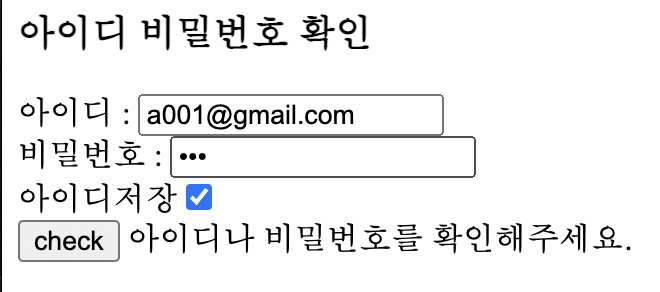

# Javascript 에서 쿠키 사용하기

자바 수업시간에 쿠키와 세션에 대해 배웠습니다.   
서버에서 이루어지는 세션은 그렇다 쳐도, 어차피 사용자의 컴퓨터에 저장될 쿠키데이터를 위해 서블릿까지 추가하는건 좀 부담스러워서 쿠키를 다루는 사항들은 웹페이지에서 바로 다뤄보려고 합니다.

> 진행중인 프로젝트에서 처음으로 쿠키를 사용할 곳은 '아이디 저장' 기능입니다.   

<br>



아직 테스트중인 페이지이기 때문에 시안이 좀 투박하나 양해 부탁드립니다.

아이디 저장을 해놓고 로그인을 하면 다음부터 해당 페이지에 접속했을때에는 굳이 아이디를 한번 더 칠 필요가 없도록 구현하려고 합니다. 안그래도 본 프로젝트에서 이메일주소를 아이디로 쓸 계획을 하고 있다보니, 아이디 입력이 번거로워 꼭 필요한 기능입니다.   
> 프로젝트가 어느정도 완성궤도에 오르면 그때는 세션을 이용해 자동 로그인 기능도 추가하려고 합니다.

<br><br>

```html
<script>
	$(document).ready(function(){
		var idCookie = getCookie("id");
		if( idCookie !== undefined)
			$('#idchk').attr("checked", true);
		
		$('#idCheck').val(idCookie);
        		$('#idchk').on('click',function(){
			if( $('#idchk:checked').val() == 'on'){
				rememberId();
			}else{
				forgetId();
			}
		})
	})
```
`원래는 로그인에 성공 해야 '아이디'를 저장하도록 해야하는데, 아직은 테스트 페이지에서는 아이디와 비밀번호 일치 단계만 확인하는 관계로 '아이디저장'체크박스를 클릭할때 해당 이벤트를 적용하도록 하여 테스트 해 보았습니다.    `      
`페이지가 열리면 idCookie라는 변수에 getCookie 함수를 호출해 id 값을 받아옵니다.
id 값이 저장이 되어 있다면 (!==undefined) 해당 체크박스는 체크 된 상태로 페이지가 열리는 것 또한 필요합니다.`

<br><br>

```javascript
function rememberId(){
	id = $('#idCheck').val().trim();
	setCookie("id", id, 30);
}

function forgetId(){
	setCookie("id",'',-1);
}
```
`각각 rememberId()와 forgetId는 다음과 같이 구현했습니다.
둘다 똑같이 setCookie를 사용하는데, 차이가 있다면 forgetId() 에서는 값이 들어갈 가운데 자리에 의미 없는 데이터를 넣고, 쿠키의 지속시간을 설정해줄 마지막 파라미터로는 과거시간을 의미하는 음수 값을 넣어줬다는 겁니다.`

<br><br>

```javascript
function setCookie(name, value, exp){
	var date = new Date();
	date.setTime(date.getTime() + exp*24*60*60*1000);
	document.cookie = name+'='+escape(value)+';expires='+date.toUTCString()+';path=1';
}
```
`setCookie 에서는 생성할 쿠키의 이름, 값, 지속시간을 데이터로 얻습니다.
exp 파라미터에 넣는 값을 지속되는 '일'로 하기 위해서 필요한 숫자를 setTime에서 exp에서 충분히 곱한 뒤에 현재 시간에서 더해줬습니다.`

>document.cookie = 부분이 실질적으로 쿠키를 저장하는 부분인데요,    
처음에 excape 없이 value로 받았다가 실수로 한글 아이디를 쳐 봤는데, 한글로 쿠키가 저장되는 바람에 해당 사이트데 접속 할 수 없는 일이 일어났습니다.  
크롬 고급설정에서 해당 쿠키값을 제거해준 뒤에야 다시 접속 할 수 있었는데요, 실제 서비스중에 일어났다간 감당할 수 없을 치명적인 버그였습니다.    
자바스크립트에서 한글 쿠키를 제대로 지원 안해주거나 브라우저쪽에서거나 둘중 하나라고 생각되는데요.. 그래서 value를 escape 함수로 인코딩해서 저장하니 해결되었습니다.

<br><br>

```javascript
function getCookie(name) {
  const value = `; ${document.cookie}`;
  const parts = value.split(`; ${name}=`);
  if (parts.length === 2) return unescape(parts.pop()).split(';').shift();
}
```
저장된 쿠키를 얻어오는 getCookie 함수입니다. unescape로 인코딩했두었던 value를 다시 디코딩 하는 과정이 꼭 필요합니다.

`위의 과정들을 통해 쿠키를 생성 / 불러오기 / 삭제 할 수 있습니다.`   
`쿠키에 관한 함수들은 html 파일에 바로 넣지 않고 js 파일속에 넣어둡니다.`